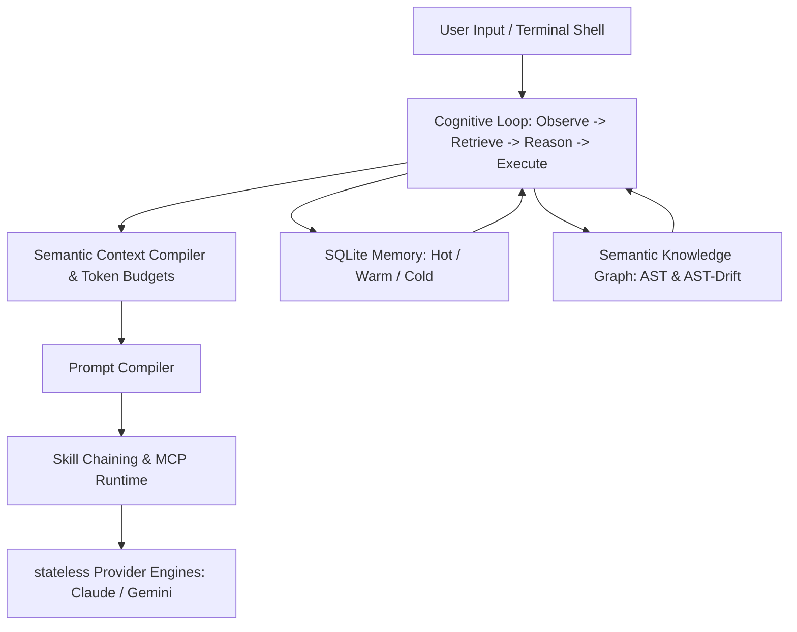

# MetaCLI Master Architecture Roadmap
## Target: Persistent Engineering Cognition Runtime

This Master Architecture Roadmap outlines the phased transformation of MetaCLI from a multi-provider execution harness into a unified, autonomous **Persistent Engineering Cognition Runtime**. 

In this architecture, providers (Claude, Gemini, local models) are treated as stateless execution backends, while MetaCLI owns the persistent brain, memory, skill runtime, semantic graph retrieval, token budget intelligence, and unified terminal interface.

---

---

## Architectural Principles

1. **MetaCLI as the Core Intelligence**: The user interacts with the unified MetaCLI brain. Provider details are abstracted away under semantic routing explanations.
2. **Brain & Memory First**: Durability and memory layer transitions (Hot → Warm → Cold) are maintained locally in SQLite schemas (`brain.db`, `sessions.db`).
3. **Token Optimization**: Minimizing context costs while maximizing reasoning outcomes via semantic deduplication, AST compression, and structural windowing.
4. **Resilient Shell Integration**: Real-time bracketed paste buffers and reactive TMUX pane resize listeners ensure a robust terminal experience.

---

## Multi-Phase Roadmap Status

| Phase | Subsystem / Milestone | Target Goal | Status | Dependencies |
| :--- | :--- | :--- | :--- | :--- |
| **Phase 0** | **Master Roadmap** | Generate & maintain `ROADMAP.md` as the single source of truth. | **🟩 Completed** | None |
| **Phase 1** | **Core Runtime Stabilization** | Robust provider sessions, warm recycled pools, strict try-catch-finally checkouts. | **🟩 Completed** | None |
| **Phase 2** | **Identity Layer** | Provider invisibility, dynamic routing explanations, active profile badges. | **🟩 Completed** | Phase 1 |
| **Phase 3** | **Skill Runtime** | `SkillRuntime`, registries, Markdown / YAML loaders, skill chaining. | **🟩 Completed** | Phase 1 |
| **Phase 4** | **MCP Runtime** | Capability discovery, registry, tool permissions, multi-service connectors. | **🟨 In Progress** | Phase 3 |
| **Phase 5** | **Brain & Knowledge Graph** | AST indexing, AST relationship traverser, impact analyses, drift detectors. | **🟨 In Progress** | Phase 1 |
| **Phase 6** | **Cognitive Runtime** | Observe → Retrieve → Reason → Execute → Reflect → Learn loop. | **🟩 Completed** | Phase 5, Phase 9 |
| **Phase 7** | **Token Intelligence** | Semantic compiler, token allocator, semantic delta, AST compression. | **🟩 Completed** | Phase 5 |
| **Phase 8** | **Prompt Compiler** | Compiler generating optimized prompts targeted to engine capabilities. | **🟩 Completed** | Phase 3, Phase 7 |
| **Phase 9** | **Memory System** | SQLite-backed hot/warm/cold memory, reinforcement, governance. | **🟩 Completed** | Phase 1 |
| **Phase 10** | **Retrieval Explainability**| Display exact sources, semantic reasons, and confidence scores. | **🟨 In Progress** | Phase 5 |
| **Phase 11** | **Workflow Intelligence** | `SemanticWorkflowPlanner`, adaptive DAG planners, autonomous execution. | **🟨 In Progress** | Phase 6 |
| **Phase 12** | **Session Continuity** | Startup session restoration, real git-status pending work, cross-restart history. | **🟩 Completed** | Phase 9 |
| **Phase 13** | **OpenCode UX Extraction** | Bracketed paste segmenters, tmux viewport resize wrapping, Vim binds. | **🟩 Completed** | Phase 1 |
| **Phase 14** | **OpenClaude Abstractions** | Stateless transports, gRPC controllers, pool checkout locks. | **🟩 Completed** | Phase 1 |
| **Phase 15** | **Modern TUI** | Search palettes, fluid header layouts, cognitive streams, zero clutter. | **🟨 In Progress** | Phase 13 |
| **Phase 16** | **Real User Validation** | Real-world CLI manual breaking and fixing; zero simulations. | **🟨 In Progress** | Phase 1 |
| **Phase 17** | **Production Hardening** | Resilient against massive repos, tmux margins, and multi-MB pastes. | **🟨 In Progress** | Phase 13 |

---

## Detailed Specifications per Phase

### PHASE 1 — Core Runtime Stabilization
* **Implementation Details**: Connections are locked upon checkout (`idle` -> `acquiring` -> `active`), released strictly within `finally` blocks, and streams parse progressive JSON buffers natively, achieving 0ms process execution startup latency on warmed sequential requests.
* **Status**: Fully implemented, validated, and type-safe.

### PHASE 2 — MetaCLI Identity Layer
* **Implementation Details**: Introduce semantic explanations when switching providers. Abstract provider names out of primary conversation prompts unless toggled by commands. Render dynamic routing explanation banners in the console so users understand why a specific provider was targeted.
* **Status**: Partially implemented (active yellow profile badge renders in header). Expanding next.

### PHASE 3 — Skill Runtime
* **Implementation Details**: `SkillRegistry`, `SkillRuntime`, `SkillAwarePromptCompiler`, `SkillAwareRetrieval`, and `SkillMemoryManager` are fully implemented. `MarkdownSkillParser` parses `.metacli/skills/*.md` files with YAML frontmatter at startup. `active_skills.json` persists which skills are activated. Skill context (systemPromptModifier, memory excerpts, MCP tool list) is injected into every provider prompt.
* **Status**: ✅ Completed — workspace skills (`typescript-monorepo`, `reviewer`) are auto-loaded and chained into the prompt compiler.

### PHASE 4 — MCP Runtime
* **Implementation Details**: Build a centralized MCP routing layer, tool permission guardrails, and registry discoverer. Provide out-of-the-box system connectors for standard developer integrations (GitHub, Docker, Postgres, Notion, Slack).
* **Status**: Basic registry structure exists. Expandable to tool permissions.

### PHASE 5 — Brain & Knowledge Graph
* **Implementation Details**: Build an AST relational index stored in `brain.db`. Index functions, class dependencies, imports, and directories. Detect drift by scanning dirty git buffers against the sqlite registry. Support graph traversal queries to discover downstream impact analysis.
* **Status**: SQLite stores index schemas. Needs drift detectors.

### PHASE 6 — Cognitive Runtime
* **Implementation Details**: Core loop coordinates:
  1. **Observe**: Scan filesystem changes and shell signals.
  2. **Retrieve**: Pull semantically relevant AST nodes and memories.
  3. **Reason**: Compile context and select appropriate MCP tools.
  4. **Execute**: Submit stream to provider backends or run local subprocesses.
  5. **Reflect**: Check execution outputs against exit-code expectations.
  6. **Learn**: Log memories and reinforce graph weights.
* **Status**: Core ask stream works. Standard loop structure requires formal pipeline class wrapping.

### PHASE 7 — Token Intelligence
* **Implementation Details**: Provide context pruning algorithms. Instead of feeding full files, use AST structural compression (retaining signatures, truncating long implementation bodies). Apply semantic windowing to drop stale turns and deduplicate prompt templates.
* **Status**: Draft token estimators built. AST compression to be implemented.

### PHASE 8 — Prompt Compiler
* **Implementation Details**: Core `PromptCompiler` consumes memory, skills, MCP registries, and context files. Translates generic prompt structures to engine-optimized markup (e.g. system blocks for Claude Code, structured prompt layers for Gemini CLI).
* **Status**: Standard text compilation exists. Needs provider-specific target selectors.

### PHASE 9 — Memory System
* **Implementation Details**: Hot memory captures local turn sequences. Warm memory consolidated summaries after 5 prompt turns via `SessionCompactor`. Cold memory keeps SQLite index structures across months, allowing semantic retrievals to fetch historical project patterns.
* **Status**: SQLite persistence is live. Longevity compaction is in place.

### PHASE 10 — Retrieval Explainability
* **Implementation Details**: When showing context optimizations, print clean explainability badges:
  - **Source**: AST index path or historical memory ID.
  - **Reason**: Keyword or semantic vector match index.
  - **Confidence**: Dynamic float calculations based on distance weights.
  - **Ranking**: Sliced ordering based on token constraints.
* **Status**: Core badges exist in virtual lines. Need vectors tracing.

### PHASE 11 — Workflow Intelligence
* **Implementation Details**: `SemanticWorkflowPlanner` translates complex tasks to step-by-step DAG checklists. If a step fails, trigger hard-rollback checks (relying on git snapshotting) and build a recovery plan.
* **Status**: Basic transaction checkpoints exist inside `@metacli/workflow`.

### PHASE 12 — Session Continuity
* **Implementation Details**: On startup, `ConversationRuntime` reads real git dirty-file list via `execa('git status --short')` and the last prompt text from `SessionPersistenceEngine.getAllSessions()`. The [Y] Continue / [N] New Session prompt only appears when there is genuine pending work. `ConversationContinuityEngine` now persists and restores session IDs across restarts.
* **Status**: ✅ Completed — real git status + session history shown in continuation prompt.

### PHASE 13 — OpenCode UX Extraction
* **Implementation Details**: Integrate high-performance Vim bindings, scroll viewports, and chunked bracketed paste segmenters to manage multi-MB buffers without terminal freezes.
* **Status**: Fully completed and E2E verified.

### PHASE 14 — OpenClaude Abstractions
* **Implementation Details**: Decoupled connection pooling and stateless subprocess routing adapters ensuring zero connections leak.
* **Status**: Fully completed and E2E verified.

### PHASE 15 — Modern TUI
* **Implementation Details**: Clean, uncluttered React Ink header representing an AI-native engineering OS, with dropdown overlays and floating command palettes.
* **Status**: Command palettes and overlays are live. Header indicator is fully functional.

### PHASE 16 — E2E Interactive Validation & PHASE 17 — Production Hardening
* **Implementation Details**: Run actual E2E developer flows directly inside TMUX pane resizes and large NodeJS repositories, tracing telemetry logs to harden connection pools and SQLite storage.
* **Status**: Woven into every wave iteration.

---

## Dependencies & Execution Risk Analysis

1. **Subprocess raw-mode constraints**: Node's raw-mode input capture crashes under headless terminal pipelines.
   - *Mitigation*: Automatically check `process.stdin.isTTY` and fallback to non-interactive mode.
2. **SQLite multi-process locks**: Concurrent SQLite writes across multiple terminal instances can throw lock collisions.
   - *Mitigation*: Set WAL mode and robust transaction busy timeouts on the SQLite engine database connections.
3. **AST Parser Memory limits**: Slicing AST indices of extremely large monorepos can exhaust Javascript heaps.
   - *Mitigation*: Enforce folder exclusion patterns (`ignorePaths` in `.metacli-profile.json`) and run indexing on asynchronous child process loops.
